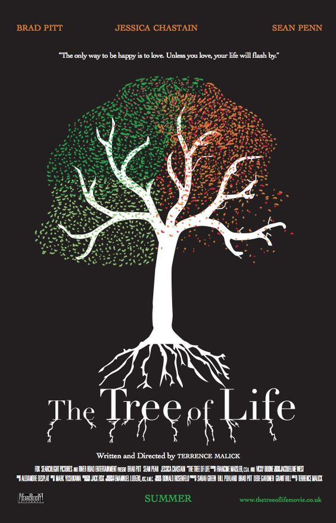

## Project Update

### 1. What You’ve Done This Week
This week, I began developing an interactive and time-based poster inspired by the movie **The Tree of Life**. My work focused on setting up the core structure of the project, including:
- Setting up a **p5.js** canvas and slider for controlling the tree’s branch angle.
- Creating a basic **tree structure** with recursive branches and seasonal changes that adjust over time.
- Initializing a **time-based cycle** that changes the background color and leaf behavior based on the current "season" (Spring, Summer, Fall, Winter).
- Developing initial interactivity with a slider that controls the branching angle, allowing users to shape the tree dynamically.

### 2. Description of Files, Classes, Objects, and Arrays

#### Files
- **index.html**: Contains the main HTML structure and references to the p5.js library.
- **sketch.js**: The main JavaScript file where all p5.js code is implemented, including classes, objects, and functions for tree growth, stars, and leaves.

#### Classes and Objects
- **Tree Class**: Represents the main structure of the tree using a recursive branching function. Each tree branch is generated based on the angle set by the slider, creating dynamic growth.
- **Leaf Class**: Represents individual leaves, which grow during Spring and Summer, fall in Autumn, and disappear in Winter. 
- **Star Class**: Represents cosmic stars in the background, which twinkle to add a cosmic effect, reinforcing the movie’s theme of universal connection.

#### Arrays
- **stars[]**: Array of Star objects that creates a star-filled background.
- **leaves[]**: Array of Leaf objects used to populate the tree with leaves, which vary based on the season.

### 3. Description of Interactivity and Time-Based Logic

#### Interactivity
- **Slider Control**: The slider allows users to adjust the tree’s branching angle, influencing the shape of the tree. This represents the idea of choice and growth.
  
#### Time-Based Logic
- **Seasonal Changes**: Every 10 seconds, the season changes, simulating the cycle of life. The season determines the background color and leaf behavior:
  - **Spring**: Tree blooms with new leaves.
  - **Summer**: Full foliage on the tree.
  - **Autumn**: Leaves begin to fall, symbolizing decay.
  - **Winter**: The tree stands bare, and a reflective quote from the movie is displayed.

### 4. Description of Functions

#### Functions Written
- **setup()**: Initializes the canvas, slider, and arrays for leaves and stars.
- **draw()**: Contains the main loop that updates the background, tree, stars, and leaf behavior based on the current season. Also checks the slider’s value to adjust the tree’s branching angle interactively.

#### Functions to Write
- **branch(len)**: A recursive function within the Tree class that creates the branching structure of the tree. Uses the slider-controlled angle to determine the direction and length of each branch.
- **changeSeason()**: A function to handle the season transitions every 10 seconds. This function adjusts the background color and calls leaf behaviors based on the current season.
- **twinkle()**: Part of the Star class, creating a twinkling effect by adjusting star brightness randomly in each frame.
- **fall()**: Part of the Leaf class, controlling the falling behavior of leaves in Autumn, giving the impression of seasonal decay.
- **displayQuote()**: Displays a quote from the movie in Winter to enhance the reflective atmosphere.

With this structure, the project reflects **The Tree of Life’s** themes of growth, change, and cosmic connection through both **interaction** and **time-based events**.

### 1. What book, album or movie did you choose? What is it about?

I chose the movie **"The Tree of Life"** directed by Terrence Malick. The film is a philosophical exploration of life, death, and the universe, juxtaposing the personal journey of a family in Texas with grand, cosmic visuals. The story reflects on themes of love, loss, the origins of life, and the connection between all living things.

### 2. What aspect of the movie will you include in your cover?

The poster will focus on **the symbolic tree** that represents life, growth, and interconnectedness. It will feature the tree growing dynamically, surrounded by a cosmic background filled with twinkling stars. The poster will also incorporate the changing of seasons to reflect life’s cycles—birth, growth, decay, and rebirth.

### 3. Is it interactive? Time-based? Both?

The poster will be **both interactive and time-based**:
- **Interactive**: The tree’s branching angle can be controlled by the user via a slider, allowing the user to manipulate how the tree grows and shapes itself.
- **Time-Based**: The poster will simulate the passage of time by changing the seasons every few seconds. 

### 4. What ideas would you like to explore or experiment with?

I would like to explore the **cyclic nature of life** through the dynamic growth of the tree, and how it visually reflects the passage of time and seasons. The interaction via the slider will allow users to actively shape the tree, symbolizing the choices and changes people experience in life. I’d also like to experiment with the **contrast between personal growth (the tree) and the vastness of the universe (the cosmic stars)**.

### 5. Are there aspects of your project that are related to any of the readings we’ve done?

The project reflects some of the conceptual ideas from **Yoko Ono’s "Grapefruit"**, focusing on minimalist visual storytelling and the passage of time.

